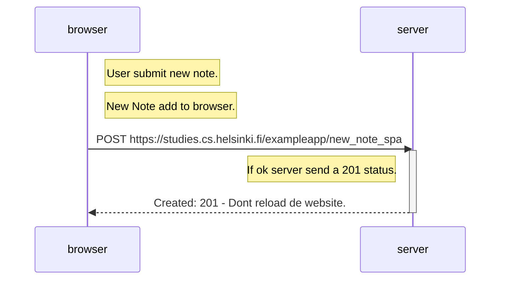

```mermaid
sequenceDiagram
    participant browser
    participant server

   Note right of browser: User submit new note.
   Note right of browser: New Note add to browser.
    browser->>server: POST https://studies.cs.helsinki.fi/exampleapp/new_note_spa
    activate server
   Note left of server: If ok server send a 201 status.

    server-->>browser: Created: 201 - Dont reload de website.
    deactivate server
```
